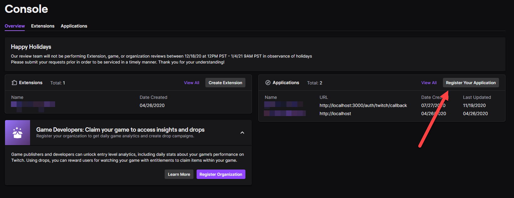
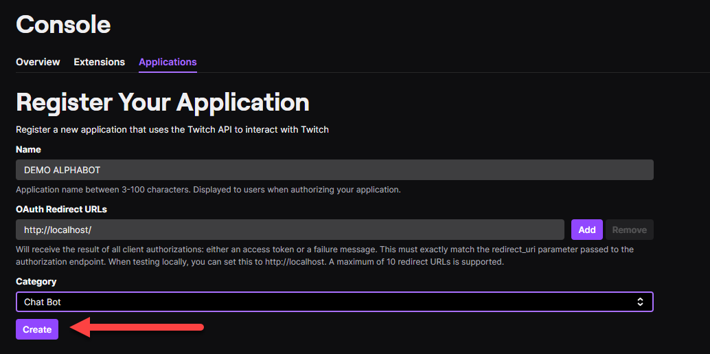
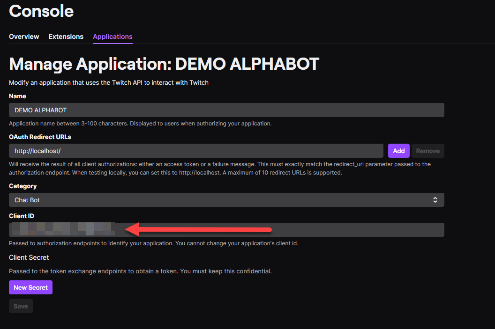

## Prerequisites

- **Browsers**: only latest Chrome/Chromium stable are supported
- **Compute Engine Instance**: We used CentOS as our distro
    - **RAM**: Minimum 512MB, Recommended 1024MB
    - **HDD**: Minimum 1GB
- Twitch bot account 
- CircleCI account

!> You need **separate** account for your bot, bot **won't** work on your
   broadcaster account

# Compute Engine Setup

The first thing you want to do when you connect to your instance is to check for updates and update yum.

```
yum check-update
yum -y update
```

## Create non-root user with sudo privileges

Now we have to do the following as root:

```
adduser alphabot
```

## Set password for user alphabot

```
passwd alphabot
```

## Give sudo privileges

```
usermod -aG wheel alphabot
```

## Generate ssh keys for circleci

```
ssh-keygen -m pem -t rsa
```

Now that the ssh keys are generated copy the private key to circleci
and copy the public key to your virtual machine in google cloud.
When you are done delete the public and private key from the .ssh directory.

## Disable SSH login as root

To disable ssh login as root uncomment the following line PermitRootLogin and set it to PermitRootLogin no. To search faster in vim you can use '/PermitRootLogin'. When you are done safe the changes and now you will have to reload ss

```
vim /etc/ssh/sshd_config
```

```
systemctl reload sshd
```

## Setup Firewall

If you are using Compute Engine you will not have to setup the firewall since it already is setup by google per default.

## Setup Swap file

```
fallocate -l 4G /swapfile
chmod 600 /swapfile
mkswap /swapfile
swapon /swapfile
sh -c 'echo "/swapfile none swap sw 0 0" >> /etc/fstab'
```

## Setup docker

first install [containerd.io](http://containerd.io/) without you will not be able to install docker.

```
yum install -y [https://download.docker.com/linux/centos/7/x86_64/stable/Packages/containerd.io-1.2.6-3.3.el7.x86_64.rpm](https://download.docker.com/linux/centos/7/x86_64/stable/Packages/containerd.io-1.2.6-3.3.el7.x86_64.rpm)
```

Now you can install docker and add the user alphabot to the docker group so the user will be able to execute docker commands without using sudo.

```
curl -fsSL [https://get.docker.com/](https://get.docker.com/) | sh
sudo usermod -aG docker alphabot
sudo systemctl start docker
sudo systemctl enable docker
```

## Setup GIT

First you will have to install git you can do this with the following command.

```
yum install -y git
```

Now we will add the username and email to git which will be used to authenticate later.

```
git config --global user.name <username>
git config --global user.email <email>
```

Now to authenticate over SSH we need to generate SSH-keys for git.

```
ssh-keygen -t rsa -b 4096 -C <email>
```

### Adding your SSH key to the ssh-agent

- Start the ssh-agent in the background.

```
$ eval "$(ssh-agent -s)"
> Agent pid 59566
```

- Add your SSH private key to the SSH-agent. If you created your key with a different name, or if you are adding an existing key that has a different name, replace id_rsa in the command with the name of your private key file.

```
$ ssh-add ~/.ssh/id_rsa
```

When you followed the steps above add the public SSH key to GitHub and you should be done. You can add you SSH key on GitHub under Settings → SSH and GPG keys → New SSH key

## Setup DNS entry
[Google Cloud Quickstart Guide](https://cloud.google.com/dns/docs/quickstart)

<br/><br/>

# Deployment Script 

Create a file and insert the script below. :rocket:

```bash
#!/bin/bash

echo "Pulling from git"
cd ~/git/alphabot
git stash push --include-untracked
git stash drop
git pull

if [ $(docker ps -f name=alpha-blue -q) ]
then
    docker rm $(docker stop $(docker ps -q -f name=alpha-green))
    ENV="green"
    OLD="blue"
	  PORT="8081"
else
	docker rm $(docker stop $(docker ps -q -f name=alpha-blue))
    ENV="blue"
    OLD="green"
    PORT="8080"
fi

echo "Untaging current image"
docker tag alphabot:latest alphabot:old
docker rmi alphabot:latest

echo "Building new image"
docker build -t alphabot ~/git/alphabot

echo "Starting "$ENV" container"
docker run -itd -e PORT=$PORT -p $PORT:$PORT --restart unless-stopped --name=alpha-$ENV alphabot:latest

echo "Waiting..."
sleep 5s

echo "Stopping "$OLD" container"
docker rm $(docker stop $(docker ps -q -f name=alpha-$OLD))

echo "Removing old image"
docker rmi alphabot:old
```

# Nginx Setup

### Check if SE Linux is installed

if the following command returns enforcing SE Linux is installed and you will not have to do any extra steps.

```
getenforce
```

### Set bool variables for SE Linux

```
setsebool -P httpd_can_network_connect on
setsebool -P httpd_enable_homedirs on
```

### Install following

To be able to install nginx we will need **epel-release**

```
yum install -y epel-release
yum install -y nginx
```

Now that we installed nginx we can start it. The second command is used to see if everything worked fine.

```
systemctl start nginx
systemctl status nginx
```

To have nginx restart even after the system is rebooted we will have to do the following:

```
systemctl enable nginx
```

To write our own config we will create our own nginx config file which has to be located under */etc/nginx/conf.d/alphabot.conf*

After we wrote our config we need to check if the config we wrote even works we can achieve this with an easy nginx comman

```
nginx -t
```

## Setup HTTPS

There is a great tool for creating certificates which we will use now.

```
yum -y install certbot
```

We will now be able to request a certificate with certbot and certbot will do the heavy lifting for us.

```
certbot certonly --standalone -d <DOMAIN>
```

Now we should create an backup of our certificate in case something happens

```
cp -r /etc/letsencrypt/ /home/alphabot
tar czf letsencrypt.tar.gz letsencrypt/
```

We have done almost everything now, the last thing to do will be to edit our nginx config to only allow https traffic. Mozilla has built a great toll which we will use [https://ssl-config.mozilla.org/](https://ssl-config.mozilla.org/)

### Setup Crontab to auto renew certificates

First we will have to start crontab and enable it so it will start automatically on machine restart.

```bash
sudo systemctl start crond.service
sudo systemctl enable crond.service
```

With `sudo crontab -e` you can add a crontab. The following crontab will try to renew the SSL certificates every Monday at 6:30 am if it renewed successfully it will reload nginx.

```bash
30 6 * * 1 certbot renew -n -q --pre-hook "systemctl stop nginx" --deploy-hook "systemctl start nginx"
```

My final config looks like this:

```bash
upstream alphabot {
   ip_hash;
   server localhost:8080;
   server localhost:8081;
}

server {
   listen       80;
   listen       [::]:80;

   return 301 https://$host$request_uri;
}

server {
    listen 80;
    server_name <SERVER_IP>;

    return 301 https://<DOMAIN>$request_uri;
}

server {
    listen 443 ssl http2;
    listen [::]:443 ssl http2;
    server_name <DOMAIN>;

    ssl_certificate /etc/letsencrypt/live/<DOMAIN>/fullchain.pem;
    ssl_certificate_key /etc/letsencrypt/live/<DOMAIN>/privkey.pem;
    ssl_session_timeout 1d;
    ssl_session_cache shared:MozSSL:10m;  # about 40000 sessions
    ssl_session_tickets off;

    # curl https://ssl-config.mozilla.org/ffdhe2048.txt > /path/to/dhparam
    # ssl_dhparam /path/to/dhparam;

    # intermediate configuration
    ssl_protocols TLSv1.2 TLSv1.3;
    ssl_ciphers ECDHE-ECDSA-AES128-GCM-SHA256:ECDHE-RSA-AES128-GCM-SHA256:ECDHE-ECDSA-AES256-GCM-SHA384:ECDHE-RSA-AES256-GCM-SHA384:ECDHE-ECDSA-CHACHA20-POLY1305:ECDHE-RSA-CHACHA20-POLY1305:DHE-RSA-AES128-GCM-SHA256:DHE-RSA-AES256-GCM-SHA384;
    ssl_prefer_server_ciphers off;

    # HSTS (ngx_http_headers_module is required) (63072000 seconds)
    #add_header Strict-Transport-Security "max-age=63072000; includeSubDomains" always;

    # OCSP stapling
    #ssl_stapling on;
    #ssl_stapling_verify on;

    # verify chain of trust of OCSP response using Root CA and Intermediate certs
    #ssl_trusted_certificate /path/to/root_CA_cert_plus_intermediates;

    # replace with the IP address of your resolver
    resolver 1.1.1.1;

    proxy_set_header Host $http_host;
    proxy_set_header X-Real-IP $remote_addr;
    proxy_set_header X-Forwarded-For $proxy_add_x_forwarded_for;

    location / {
       proxy_pass "http://alphabot/";
    }

    error_page 404 /404.html;
       location = /40x.html {
    }

    error_page 500 502 503 504 /50x.html;
       location = /50x.html {
    }
}
```

# Redis Setup

For the redis setup we recommend you to follow the <a href="https://redis.io/topics/quickstart">Redis Quickstart Guide</a>.

# .env Setup
```
DB_CONNECTION=<MONGODB_CONNECTION_STRING>
TOKEN_SECRET=<TOKEN_SECRET>
REDIS_PORT=<PORT>
REDIS_HOST=<HOST>
REDIS_PASSWORD=<PASSWORD>
CLIENT_SECRET=<SECRET>
CLIENT_ID=<ID>
REFRESH_TOKEN=<REFRESH_TOKEN>
ACCESS_TOKEN=<ACCESS_TOKEN>
```

## TOKEN_SECRET
Is the token which is used with passport to encrypt and decrypt the API user credentials. You can use a password generator or you could just press all buttons on your keyboard :clown_face:. 

## Redis Credentials

### REDIS_PORT
The redis port should be 6379 if you followed the redis setup.

### REDIS_HOST
The redis host should be 127.0.0.1 if you followed the redis setup.

### REDIS_PASSWORD
You can remove this from your .env file if you have not set a password for redis.

## Twitch Credentials

1. Go to <a href="https://dev.twitch.tv/">dev.twitch.tv</a> login with your bot twitch account.
2. Press Your Console
3. Then press Create app <br/>
 
4. Fill in the name of the application and press create  <br/>
  
5. Now presse **manage** on your created application <br/>
 

### CLIENT_SECRET
After you pressed **manage** on your application, press New Secret and copy it.


### CLIENT_ID
After you pressed **manage** on your application copy the Client id.


<br/><br/><br/><br/>

# CircleCI Setup

On CircleCI conntet the GitHub Repository which contains the code. Under Project Settings add the Github SSH key and add a SSH key from your Compute Eninge.  