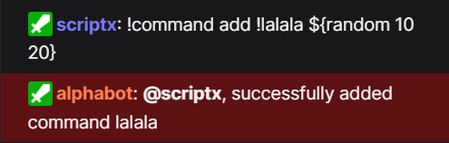
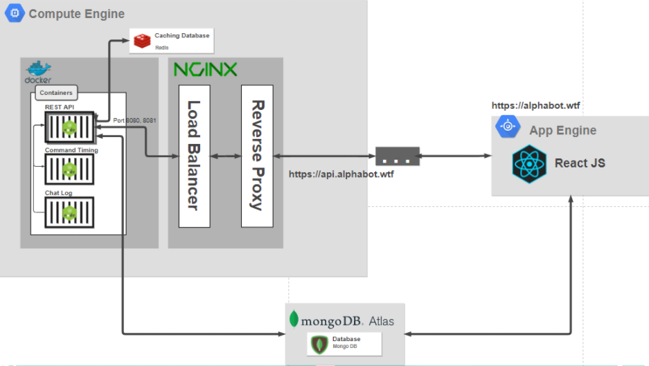

<h1 align="center">
   
  
</h1>

<h4 align="center">适合所有人的高品质流式机器人</h4>

    
    
    
    

## 球队

<ul>
  <li><a href="https://github.com/SXRIPT">Filip Adamovic</a></li>
  <li><a href="https://github.com/kingyigi">Yigithan Gündüz</a></li>
  <li><a href="https://github.com/LeM4">Mario Schrolmberger</a></li>
</ul>

## 这是什么
alphabot是一项服务，提供Twitch机器人和各种工具来管理，监视和保护您的流媒体体验

正在运行的alphabot示例： 

## 建筑概述

## Bundlephobia 结果

 

